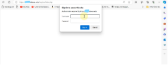
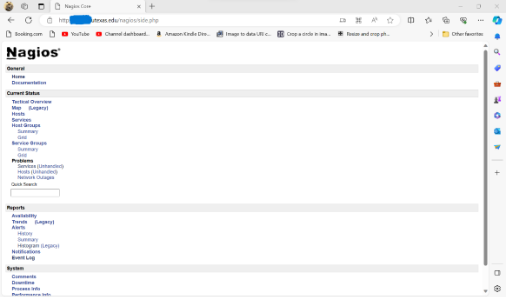

**Critical Exposed Nagios Dashboard: Found in Texas University and How to Exploit It**

Hello, fellow penetration testers and bug bounty hunters! Today, we're going to discuss a vulnerability that often goes unnoticed: exposed Nagios dashboards with default credentials. Nagios is a widely used open-source monitoring tool, and unfortunately, many administrators fail to change the default credentials after installation. Let's dive into the details of this issue, how to identify it, and how to exploit it when authorized to do so.

**Understanding Nagios Default Credentials**

Nagios comes with default credentials out of the box to allow quick setup and configuration. These credentials are:

- Username: **nagiosadmin**
- Password: (blank, or sometimes **nagios**)

While it's recommended to change these credentials immediately after installation, many administrators overlook this step, leaving their Nagios dashboards exposed to potential attackers.

**Identifying Exposed Nagios Dashboards**

Before we can exploit this vulnerability, we need to find exposed Nagios dashboards. Here are a few methods to do that:

1. **Search Engines**: Use search engines like Google, Bing, or Shodan to find Nagios dashboards that are publicly accessible. You can use queries like:
   1. **inurl:"nagios/cgi-bin/**
   1. **inurl:"nagios/"**
   1. **nagios intitle:"index of"**
1. **Subdomain Enumeration**: Enumerate subdomains using tools like **knockpy**, **amass**, or **subfinder**. Once you have a list of subdomains, check if any of them are running Nagios.
1. **Vulnerability Scanners**: Use vulnerability scanners like Nuclei and others to identify Nagios instances and check for default credentials.

**Exploiting Nagios Default Credentials**

Once you've identified an exposed Nagios dashboard, it's time to exploit the default credentials. Here's a step-by-step guide:

1. **Access the Nagios Login Page**: Navigate to the Nagios login page, usually located at **target.com/nagios/side.php**

2. **Login with Default Credentials**: Attempt to log in using the default credentials (**nagiosadmin** and a blank password, or **nagios** if required).
   1. If the credentials are correct, you'll be granted access to the Nagios dashboard.

      

   1. If the credentials are incorrect, you might need to try a few common password variations (e.g., **nagiosadmin**, **admin**, **root**, etc.) or use a password spraying technique to find the correct password.
2. **Gain Access to the Nagios Dashboard**: Upon successful login, you'll gain access to the Nagios dashboard, providing you with valuable information about the target's infrastructure, services, and potential vulnerabilities.

**Escalating Privileges and Post-Exploitation**

With access to the Nagios dashboard, you can gather valuable intelligence about the target's environment. However, to truly make the most of this vulnerability, you'll want to escalate your privileges and gain access to the underlying system.

1. **Identify the Nagios Version**: Check the Nagios version by looking at the footer of the dashboard or using the following URL: **http://<target>/nagios/version.php**. This information will help you determine if there are any known vulnerabilities that can be exploited.
1. **Exploit Known Vulnerabilities**: Search for known vulnerabilities in the exposed Nagios version using resources like the [NIST National Vulnerability Database](https://nvd.nist.gov/) or [Exploit-DB](https://www.exploit-db.com/). If a relevant vulnerability exists, exploit it to gain remote code execution or escalate privileges.
1. **Lateral Movement**: With access to the underlying system, use lateral movement techniques to explore the target's network, enumerate users, and escalate privileges further.

**Responsible Disclosure**

If you've found an exposed Nagios dashboard with default credentials during a bug bounty engagement or penetration test, responsibly disclose the vulnerability to the target organization. Provide them with clear steps to reproduce the issue, the impact of the vulnerability, and recommendations to remediate it.

**Conclusion**

Exposed Nagios dashboards with default credentials are a common vulnerability that can provide valuable intelligence about a target's infrastructure. By understanding how to identify and exploit this vulnerability, you can effectively gather information and escalate privileges during penetration tests and bug bounty engagements. Always remember to follow responsible disclosure practices and only test targets for which you have explicit permission.

Happy hacking! **Preventing Nagios Default Credential Vulnerabilities**

To prevent Nagios default credential vulnerabilities, administrators should follow these best practices:

1. **Change Default Credentials**: Immediately after installation, change the default Nagios credentials to strong, unique passwords. Make sure to use a password manager to securely store these credentials.
1. **Limit Access**: Restrict access to the Nagios dashboard by configuring firewall rules, IP whitelisting, or using an authentication proxy like Apache's **mod\_authz\_host**.
1. **Keep Nagios Up-to-date**: Regularly update Nagios to the latest version to ensure you have the latest security patches and features.
1. **Monitor for Unauthorized Access**: Implement logging and monitoring solutions to detect and alert on unauthorized access attempts to the Nagios dashboard.
1. **Regularly Review and Audit**: Periodically review and audit Nagios configurations and access logs to ensure the security of your monitoring infrastructure.

By following these best practices, administrators can significantly reduce the risk of exposed Nagios dashboards with default credentials, helping to protect their organizations from potential security breaches.

